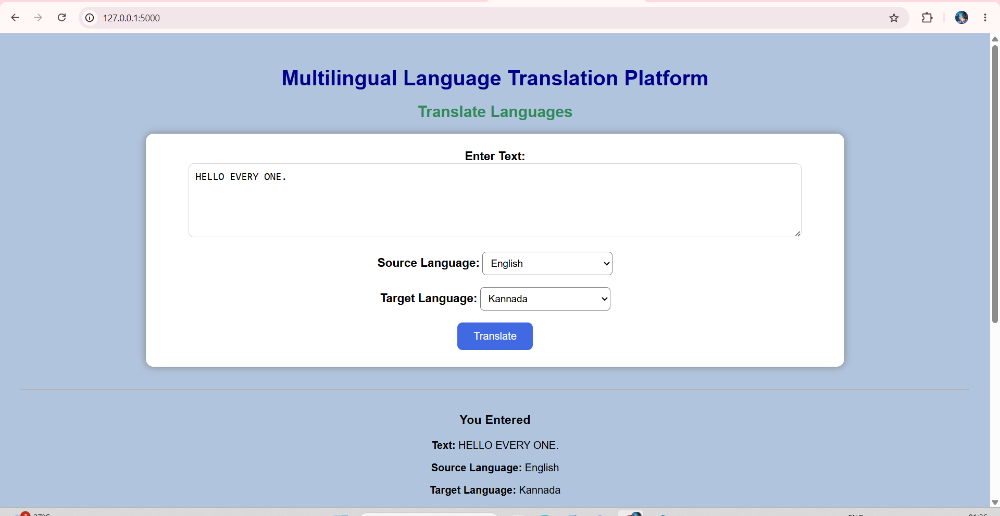
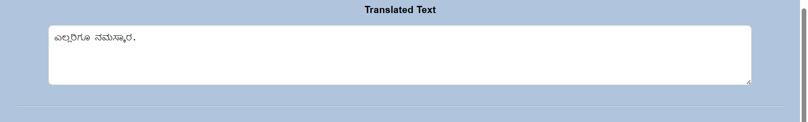
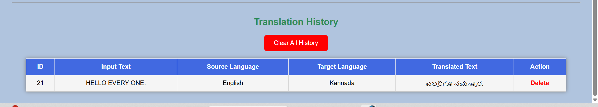
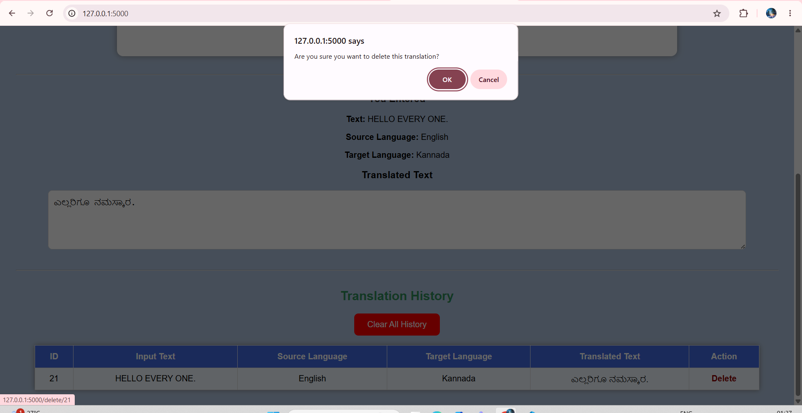
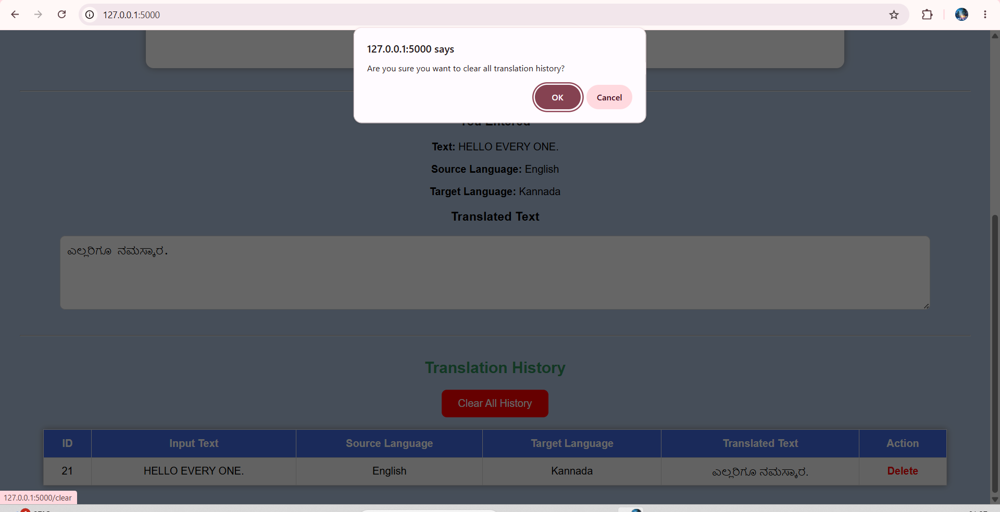

# 🌍 Multilingual Language Translation Platform

## 📌 Project Overview

The Multilingual Language Translation Platform is a web application developed using Flask and MySQL. It allows users to translate text between multiple languages, stores every translation in a MySQL database, and provides translation history management.

---

## ✨ Features

- Translate text between multiple languages
- Save translations in MySQL database
- View translation history
- Delete individual translations
- Clear all translation history
- Simple and user-friendly interface

---

## 🛠 Technologies Used

- Python
- Flask
- HTML
- CSS
- MySQL
- Jinja2
- deep-translator

---

## 📂 Project Structure

```
multilingual-language-translation-platform/
│
├── app.py
├── README.md
├── requirements.txt
├── static/
│   └── css/
│       └── style.css
├── templates/
│   └── index.html
└── venv/
```

---

## ⚙ Installation

1. Clone the repository

```
git clone <repository-url>
```

2. Move into the project folder

```
cd multilingual-language-translation-platform
```

3. Install the required packages

```
pip install -r requirements.txt
```

4. Configure MySQL

- Create a database named `translator_db`
- Create the `translations` table

5. Run the application

```
python app.py
```

---

## 🚀 Future Improvements

- User Login System
- Speech-to-Text
- Text-to-Speech
- Translation Download
- More Languages

---

## 📸 Screenshots

### Home Page



### Translation Result



### Translation History



### Delete Translation



### Clear History



## 👨‍💻 Developed By

**Vishal Dayalu**